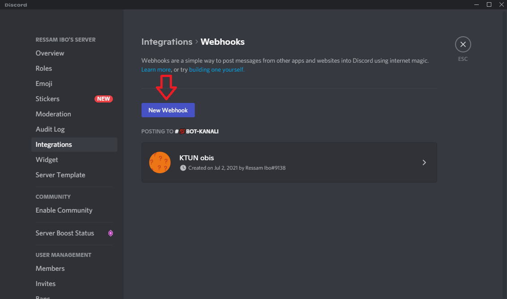
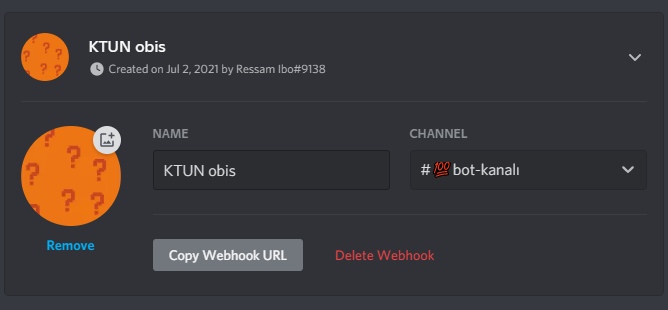
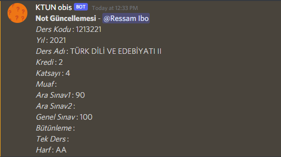

# KTUN_Obis

<!-- PROJECT LOGO -->
<br />
<p align="center">
  <a href="https://github.com/uysalibov/KTUN_Obis">
    
  </a>

  <h3 align="center">KTUN Öğrenci Bilgi Sistemi</h3>

  <p align="center">
    KTUN Öğrenci Bilgi Sistemine selenium kullanarak girip setttings.py dosyasında verdiğiniz bilgileri doldurup ardından opencv kullanarak captcha kodunu çözen ve not bilgilerine giriş yapıp not bilgilerinizi kaydeden uygulama. Her 15 dakikada bir tekrar notları çeken sistem size değişen not olduğu zaman Discord Webhooklarını kullanarak size etiketler ve size değişen notları gönderir.
  </p>
  <a href="https://github.com/uysalibov/KTUN_Obis">
    
  </a>
  <a href="https://github.com/uysalibov/KTUN_Obis">
    
  </a>
  <a href="https://github.com/uysalibov/KTUN_Obis">
    
  </a>
</p>

<!-- GETTING STARTED -->
### Başlangıç

Dosyaları indirip kuruluma başlayın.

### Virtual Environment

Paket uyumsuzluklarını önlemek için sanal ortam oluşturmalıyız.
* pip
  ```sh
  pip install virtualenv
  ```
 virtualenv ile venv adında bir sanal ortam oluşturuyoruz. (venv yerine istediğiniz ismi verebilirsiniz)
  ```sh
  virtualenv venv
  ```
 Sanal ortamı aktive ediyoruz.
  ```sh
  venv\Scripts\activate
  ```

### Kurulum

1. Dosyaları bilgisayarına indirin.
2. settings.py dosyasını düzenleyin
   ```py
   # <örnek> kısımlarını silip kendi bilgilerinizi girin 

    EMAIL='<email adresin>'
    PASSWORD='<şifren>'
    WEBHOOK_URL='<webhook linki>'
    DISCORD_USER_ID='<discord id>'
   ```
   <a href="https://support.discord.com/hc/tr/articles/228383668-Webhooklara-Giriş">
    Discord Webhook hakkında detaylı bilgi için tıkla.
   </a>
   <br />
   <a href="https://support.discord.com/hc/tr/articles/206346498-Kullanıcı-Sunucu-Mesaj-ID-sini-Nerden-Bulurum-">
    Discord kullanıcı ID'sini nereden bulacağını bilmiyorsan tıkla.
   </a>
3. Gerekli kütüphaneleri kurun.
  ```sh
  pip install -r requirements.txt
  ```
 4. Uygulamayı çalıştırın.
 ```sh
 python -m main.py
 ```
